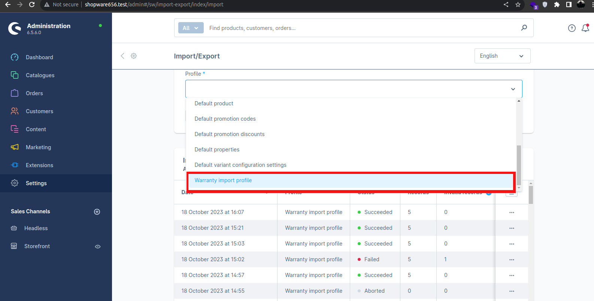

# Shopware 6.5 Warranty Manager Plugin 

This a initial plugin that  allows you to manage customer warranties in Shopware 6. 
You can also import and export warranty data using CSV files, which makes it easy to transfer and backup your data.
This plugin is useful for merchants who want to provide better customer service and keep track of their warranty obligations.
## Features
<ul>
<li> Bulk upload customer warranties using a CSV file with the following format:</li>
<pre>
<code>
product_number;customer_number;warranty_text;warranty_duration
;;;
SWDEMO10007;SWDEMO10000;"test text for product SWDEMO10007";11
SWDEMO10006;SWDEMO10000;"test text for product SWDEMO10007";10
SWDEMO10006;SWDEMO10000;"test text for product SWDEMO10007";8
SWDEMO10001;SWDEMO10000;"test text for product SWDEMO10007";7
SWDEMO10006;SWDEMO10000;"test text for product SWDEMO100013";5
</code>
</pre>

<li>  Can import your the CSV from administration panel  or command line</li>

<pre>
php bin/console warrantyManager:importCsv
</pre>
</ul>

